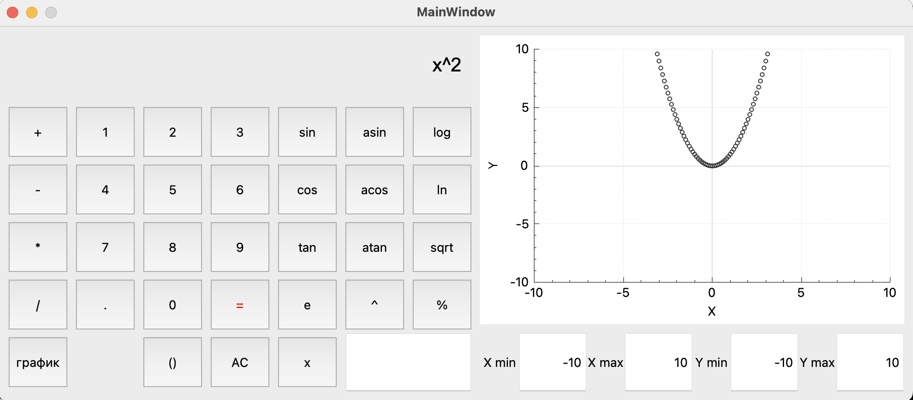

# SmartCalc

Десктопное приложение для вычеслений и построения графика. 
График имеет настраиваемый маштаб. 
При разработке использовался архетектурный паттерн MVC с тонким контроллером. В контроллере производится валидация, введённой строки. В моделе строка разбивается на токены, производятся вычисления с помощью обратной польской нотации и возвращает ответ на вью. Многократным вызывом вычислений строится массив значений для графика.

.png) _Пример вывода графика №1_  
+cos(x)+x.png) _Пример вывода графика №2_  
.png) _Пример вывода графика №3_  
 _Пример вывода графика №4_  